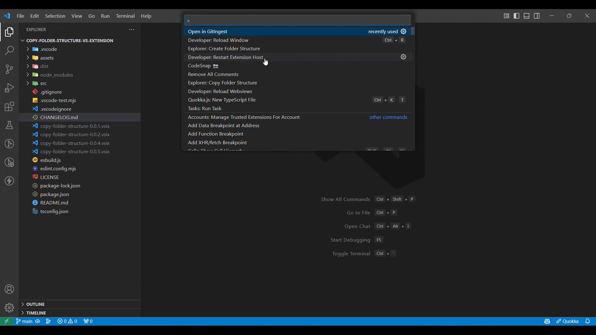

# VScode-GitIngest Opener

A VS Code extension that allows you to quickly open GitHub repositories in GitIngest.

## Features

* Open any GitHub repository in GitIngest with a single command
* Automatically detects current branch
* Supports both HTTPS and SSH repository URLs
* Prevents opening private repositories (not supported by GitIngest)

## Usage

1. Open a GitHub repository in VS Code
2. Press `Cmd/Ctrl + Shift + P` to open the command palette
3. Type **`Open in GitIngest`** and select the command
4. The repository will open in GitIngest in your default browser

## Known Limitations

* Only supports public GitHub repositories
* Private repositories cannot be opened in GitIngest

## License:

This project is licensed under the MIT License - see the [LICENSE](./LICENSE) file for details.

## Contact:

For questions or feedback, open an issue on the [GitHub repository](https://github.com/ShreyPurohit/vscode-gitingest/issues).
